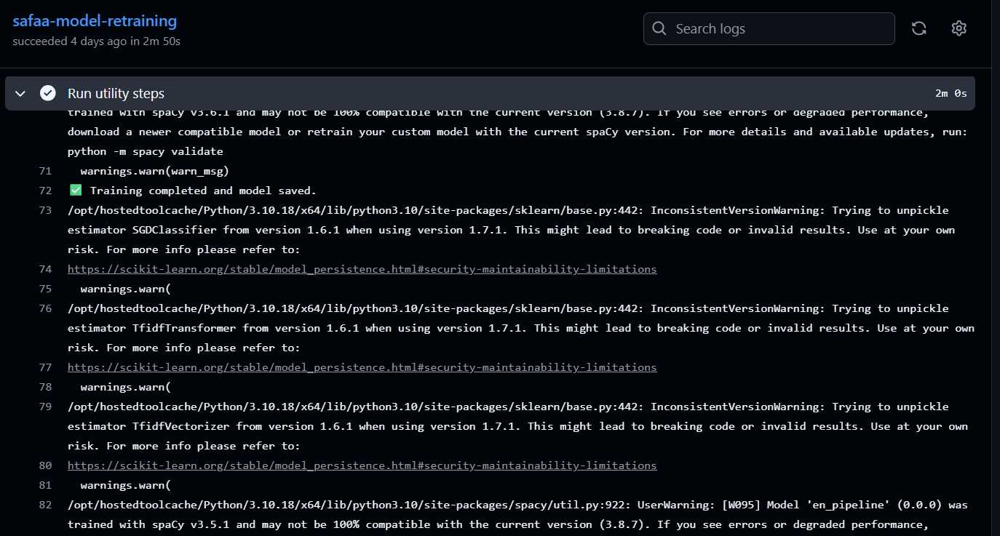
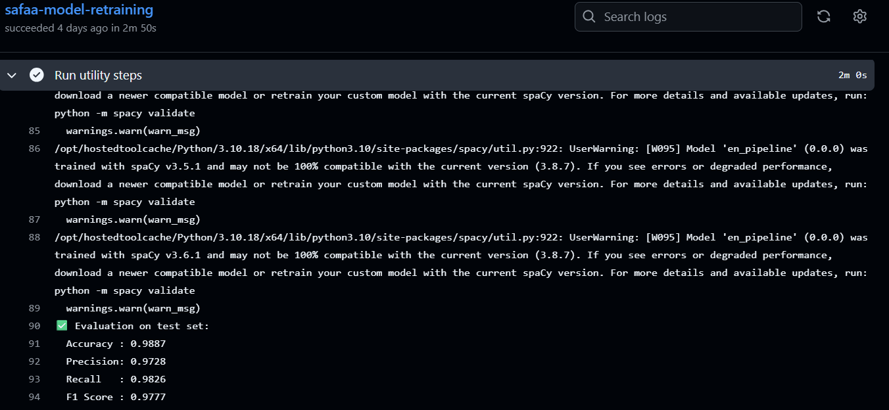
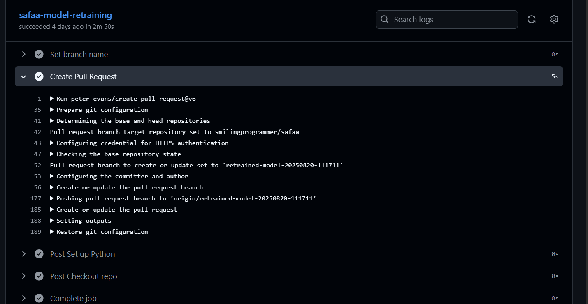
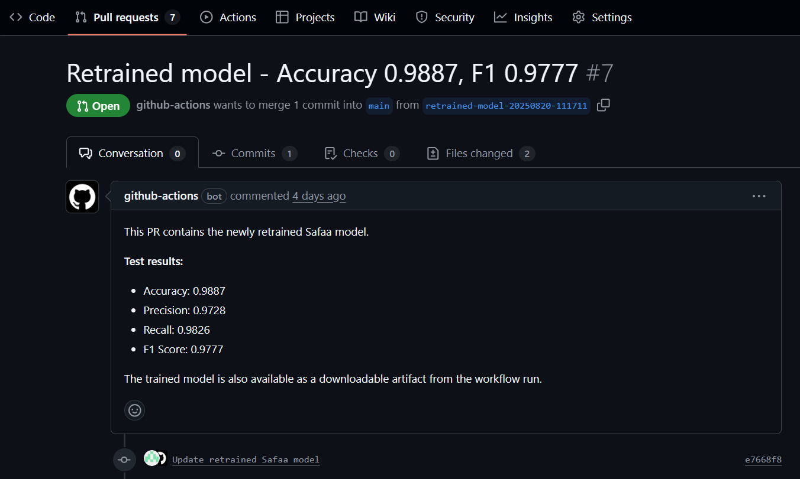
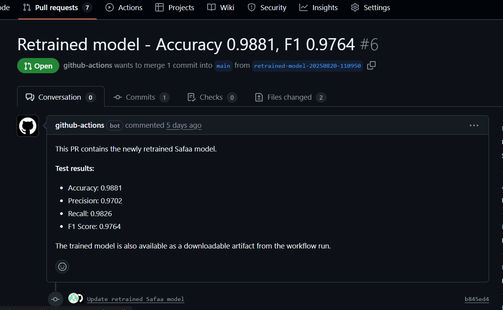

<h2><i>Data Pipeline for Safaa @ <a href = "https://www.fossology.org/">FOSSology </a> </i></h2>

	<a href="#project-details">Project Details</a> | 
	<a href="#contributions">Contributions</a> | 
	<a href="#metrics">Metrics</a> | 
	<a href="#future-goals">Future Goals</a> | 
	<a href="#key-takeaways">Key Takeaways</a>

<h1 id = "project-details">Project Details</h1>
Safaa is a Python package designed for handling false positive detection in copyright notices. Additionally, it can declutter copyright notices, removing unnecessary extra text. It entails an Agent to compliment FOSSology's copyright scanner and find false positive findings.

Currently in Safaa Project data is manually curated And we see that most of the things are manual done here. This project will concentrate on creating a pipeline, Scripts to fetch copyright data automatically from fossology instance server, preprocess the data, use the data to retrain the model, all from the CI/CD pipeline using GitHub Action, while also Utilizing LLMS and deep learning techniques to increase the accuracy of our output.

 

<h1 id = "contributions"> Contributions</h1>
<h4>Data Pipeline for Safaa</h4>

<i>A Pipeline to automate retraining of Safaa model</i>

- Code Main PR: [GitHub](https://github.com/fossology/safaa/pull/22)
- Documentation: [Pipeline-Wiki](https://fossology.github.io/gsoc/docs/2025/data-pipeline)

Currently, Safaa provides a strong framework designed to deal with copyright notices particularly focusing on the identification and reduction of false positives, as well as streamlining the decluttering procedure to remove unnecessary content. Key features of Safaa include:

1. Model Flexibility
2. Integration with scikit-learn
3. spaCy Integration
4. Preprocessing Tools 

However, Currently in the Safaa Project, data is manually curated And we see that most of the things are manual here. This project concentrated on creating a pipeline, by writing scripts to copy copyright data automatically(group's data or some users data) from fossology server instance through to the stage of re-training the model.

<h3> Here are the steps we achieved in the pipeline </h3>

- Created Scripts to fetch the copyright data from FOSSology Server copyright table (localhost)
- Utilized pre-written processing functions to clean and preprocess fetched copyright data
- Split data for training/validation/test.
- Re-Train false/positive model as well as declutter model by utilizing pre-written train functions
- Model evaluation (check for accuracy, precision, recall, and F1 score)
- Model versioning and automating release PR directly from retraining pieline
- Integrated to work with Github Action.
- Manual trigger of Pipeline.

The project was created by the code easily understood for future contibutions. Well structured for understanding, and to be easily used for retraining of Safaa model through GitHub action. Additionally made easier to make decision on whether to merge retrained model PR or not.

  

  

  

### Pull Request & Commits Authored:
- [feat(pipeline): Data Pipeline for Safaa main PR](https://github.com/fossology/safaa/pull/22) (PR)
- [feat(script): Integrated script to preprocess fetched copyright content, and added it into the pipeline](https://github.com/fossology/safaa/pull/22/commits/8e6fc6084cd7b0479f102ca3fb409dbdc7deac24)(commit)
- [feat(script): add script to fetch copyright from server](https://github.com/fossology/safaa/pull/22/commits/cff1df9726db45471cdb19e7f018f8897dd955b6)(commit)
- [feat(script): Resolve corrections in script for fetching of content from the fossology serv](https://github.com/fossology/safaa/pull/22/commits/ba63bf596a1b64d0bc1605cf902a87062ef573b9)(commit)
- [feat(script): added different files into one single script with their various functionalities](https://github.com/fossology/safaa/pull/22/commits/910e8bb628e768456b2ac337d79afc4c14732b59)(commit)
- [feat(script): Resolve corrections in pipeline.yml script](https://github.com/fossology/safaa/pull/22/commits/a09195d53c9fd0856b763cf620b9821a918b8d89)(commit)
- [feat(script): changed pipeline scripts location, and renamed folder to 'retraining'](https://github.com/fossology/safaa/pull/22/commits/197e69460eb705263b4587f48dc93d67c0fc7bdd)(commit)
- [feat(script): resolve corrections in pipeline.yml scrit](https://github.com/fossology/safaa/pull/22/commits/b1bbfdcb9d93fc959f5591a63a1d612c5022fc04)(commit)
- [1. feat(script): made huge update to the scripts regarding path and pipeline conflict](https://github.com/fossology/safaa/pull/22/commits/3ed93832bed94b8ea72c5070aba0e572710528b8)(commit)
- [2. feat(script): made huge update to the scripts regarding path and pipeline conflict](https://github.com/fossology/safaa/pull/22/commits/40f45e6efe3e4cb7fc5007c3d1bfc769c2ef1b46)(commit)
- [feat(script): declared global paths, implements argument, and direct dependency installation](https://github.com/fossology/safaa/pull/22/commits/22660f7e2e767f619d0974200c98df3f21d5871a)(commit)
- [feat(script): implemented training script in pipeline](https://github.com/fossology/safaa/pull/22/commits/d1e63cd4cea0b8b789e7933eccadcd144dd22ea4)(commit)
- [feat(script): fixed path conflict](https://github.com/fossology/safaa/pull/22/commits/bff64a5746e437115749ad0406dc7834dd92fb7c)(commit)
- [feat(script): updated sql script to leave out ignored contents when fetching](https://github.com/fossology/safaa/pull/22/commits/c6de8df599f8757a817cfb6adbcd52bad478ffce)(commit)
- [feat(script): integrated both the testing phase in the .yml file and retraining script](https://github.com/fossology/safaa/pull/22/commits/5245a381e101f9fe688eeff5c34f6752442c4ad3)(commit)
- [feat(script): added declutter model & entity recognizer folders to utility path for easier pipeline metrics](https://github.com/fossology/safaa/pull/22/commits/e12372bea17991777578145975ee599f93a73e99)(commit)
- [feat(script): removed all requirements.txt relations](https://github.com/fossology/safaa/pull/22/commits/98b03a63a47be20a41dbd257f445826172cd5191)(commit)
- [feat(script): fixed preprocessing and decluttering to maintain dataframe alignment](https://github.com/fossology/safaa/pull/22/commits/46e4c8d60fc047320218db54336ecc6b5959bf43)(commit)
- [feat(script): added data for testing pipeline](https://github.com/fossology/safaa/pull/22/commits/852b7641300961c06c1ca0d574d440e08f96c9df)(commit)
- [feat(script): updated pipeline scripts to automate creation of PR](https://github.com/fossology/safaa/pull/22/commits/f596515fa754962ea61fa0d247ddb3e0c8952ee1)(commit)

<h3 id = "metrics"> Safaa Retraining Pipeline Metrics </h3>

Currently the Safaa model makes use of the below models;
- False positive detector (SGD classifier)
- Text vectorizer
- Named entity recognizer (spaCy model)
- Declutter model (spaCy model)

For integrating a training step in our pipeline, i made use of the existing training script currently provided in the Safaa repository.

<h4>Results</h4>

Below are the metrics result of model raised from the last 2 pull request of the retraining pipeline through GitHub Actions;

| *Metric 1*  | *Result 1* |
|-------------|------------|
| *Accuracy*  | 0.9887     |
| *Precision* | 0.9728     |
| *Recall*    | 0.9826     |
| *F1 Score*  | 0.9777     |

| *Metric 2*  | *Result 2* |
|-------------|------------|
| *Accuracy*  | 0.9881     |
| *Precision* | 0.9702     |
| *Recall*    | 0.9826     |
| *F1 Score*  | 0.9764     |

- **Screenshots of results from PR**

    1. *Result 1*

    

    2. *Result 2*

    

 
<h3 id = "future-goals"> Future Goals  </h3>

1. Integration of main fossology server (online) into the pipeline through GitHub Secrets.
2. Pipeline for the Safaa project still needs a technique to automate the labeling of copyright content fetched from fossology instance.
3. Development of training scripts that supports incremental learning on any current model integrated.
4. A research on how we can use LLM or other deep learning techniques to declutter our data.

  
<h3 id = "key-takeaways"> Key Takeaways </h3>

- Learnt alot about CI/CD pipeline concept and different ways it can be integrated into different codebase. 
- Learnt the art of collaboration and working on real-time software development.
- Massive Improvement in my Git skills, a special thank you to my mentors.
- Learnt more about the concept of writing quality codes.
- Improvement in programming skills, and code files structuring.
- Learnt about License scanning in software repositories.
- Learnt alot about Decluttering.
- Better analysis of code and debugging more easily.
- Punctuality and adaptability according to time and situation.
- Communicating properly, presenting the code and learning more on how to improve.

# Reach out to me
- [Give a follow on GitHub](https://github.com/smilingprogrammer)
- [Email](Abdulsoburoyewale@gmail.com)